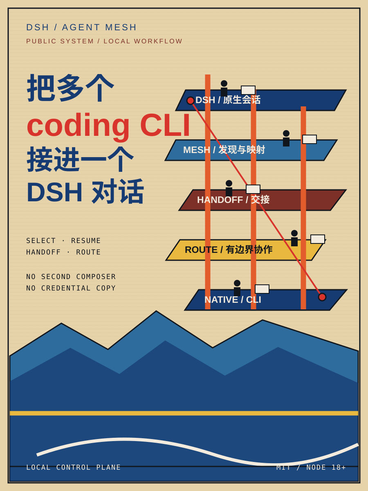

# DSH Agent Mesh

> 把本机多个 coding CLI 接进同一个 DSH 对话。
>
> 在原生模型席位里选择执行器；Agent Mesh 负责发现配置、延续会话、交接任务，并在复杂任务需要时做有边界的自动路由。

> GitHub-ready DSH plugin · MIT · Node.js 18.18+



宣传图文（6 张 3:4 卡片、源码与 QA 记录）：[local-tests/dsh-agent-mesh-social](local-tests/dsh-agent-mesh-social/)。

## 它能干什么

| 你要做的事 | Agent Mesh 做什么 |
| --- | --- |
| 接入本机工具 | 发现 Codex、Claude Code、OpenCode、Kimi、OMP、Pi、ZCode 等本机 harness 和模型。 |
| 不丢上下文 | 把 `DSH 会话 × harness × model` 映射成可恢复的原生会话；超时或旧会话失效时自动重建并接续。 |
| 让多个 Agent 协作 | 支持消息、handoff 和自动路由；复杂任务才有限度展开，并设调用数、分支数、上下文和期限上限。 |

一句话：它不是第二个聊天窗口，也不是凭据管理器，而是 DSH 与本机 coding CLI 之间的控制面。

The central abstraction is:

```text
profile (harness + model + native config)
        ↓
Agent Mesh session (stable local id + native session id)
        ↓
durable message bus / normalized live events
```

## 支持的本机执行器

| Harness | Transport | Native configuration reused | Session behavior |
| --- | --- | --- | --- |
| Codex | `codex app-server --stdio` | `CODEX_HOME/config.toml` + visible entries in `models_cache.json`, native auth | `thread/start` / `thread/resume` |
| Claude Code | CLI stream JSON | `~/.claude/settings.json`, native auth/session store | persistent process + `--resume` |
| OpenCode | ACP (`opencode acp`) | `~/.config/opencode/opencode.json`/JSONC, native auth store | `session/new` / `session/load` |
| Kimi Code | ACP | `KIMI_CODE_HOME/config.toml`, native auth | `session/new` / `session/load` |
| OMP | ACP (`omp acp`) | `~/.omp/agent/config.yml`, `models.yml`/`models.json` | `session/new` / `session/load` |
| Pi | JSONL RPC | `PI_CODING_AGENT_DIR/settings.json`/`models.json` | persistent RPC process |
| ZCode | custom JSONL app-server | native installation; config discovery only where published | experimental `session/create` / `session/resume` |

Pi uses JSONL RPC: the adapter waits for the native ready frame, negotiates protocol versions, distinguishes prompt acknowledgements from `agent_end`, and reassembles bounded chunks. OMP is connected through its native ACP surface (`omp acp`) because that surface preserves OMP's provider/model/session semantics; its JSONL RPC mode remains a compatibility fallback for custom profiles. OpenCode is ACP too, but its native `opencode acp` process owns a different provider/auth/model configuration. ZCode is intentionally not mislabelled as ACP: its app-server rejects the `jsonrpc` envelope and uses different method names.

## Install into DSH

From a clone of this repository:

```bash
dsh plugin --profile web add .
```

After publishing this repository, install it directly from GitHub with the same
DSH command:

```bash
dsh plugin --profile web add <github-repository-url>
```

The release checklist is in [`docs/RELEASING.md`](docs/RELEASING.md). The
repository includes CI, an MIT license, contribution and security policies,
and a publish-content check.

The bundle contributes host tools and a native DSH client extension. It does not add a
sidebar item, overlay, dashboard, or second composer. Instead it shadows only DSH's
existing `conversation.input.model` slot: the model seat becomes a compact
`harness · model` pair in the original input bar. Chinese is the default; English is
available through DSH's locale service.

The selector reads the ordinary DSH session model directory, so sending, cancellation,
history, permissions, and transcript rendering remain DSH-native. Locally detected
Codex, Claude Code, OpenCode, Kimi Code, OMP, Pi, ZCode, and configured ACP servers are exposed
as ordinary DSH provider/model groups. No local config is copied into browser state and
no credentials are displayed.

Switching in an existing DSH session is durable: each `DSH session × harness × model`
route maps to one resumable Agent Mesh session. The first turn on a new route receives a
bounded text handoff from the visible DSH transcript; later turns go straight to the
native harness session. The cross-session message bus remains available to tools and
agents, but it is intentionally not promoted into a separate primary UI.

The same model seat also exposes one compact `自动路由` group when a usable local route
exists. It is a routing policy, not another harness: ordinary tasks use one best-fit
producer; complex, high-risk, or explicitly multi-agent tasks may run bounded parallel
producers, then use a distinct local evaluator for blind pairwise selection. No majority
vote or answer-length heuristic is used as the default, and every route has hard caps on
calls, branches, context, and deadlines. `DSH` itself remains an in-process host agent,
not a recursively spawned route. The route planner reads the same read-only discovery
profiles as the selector, so unavailable binaries or known-missing credentials are not
sent work.

## Tools

- `agent_mesh_profiles` — discovered harness/model combinations and config provenance
- `agent_mesh_discover` — refresh read-only discovery
- `agent_mesh_start` — start/resume a native session
- `agent_mesh_agents` — list persistent sessions
- `agent_mesh_send` — durable cross-session message
- `agent_mesh_handoff` — structured handoff with summary/files/tests/blockers
- `agent_mesh_inbox` — read queued messages
- `agent_mesh_cancel` — cancel a queued message by id
- `agent_mesh_doctor` — bounded no-turn health checks
- `agent_mesh_stop` — stop the process while keeping the session mapping
- `agent_mesh_route_plan` — explain the automatic route without starting a session
- `agent_mesh_route` — run a bounded single/panel/aggregate route over local CLIs
When `from` is another Mesh session id, a task gets one automatic `reply` hop
back to that session. When DSH omits `from`, the reply is written to the DSH
mailbox and can be read with `agent_mesh_inbox`; this keeps the protocol
bidirectional without pretending the host conversation is a native external
harness session. DSH itself is also a first-class participant: the plugin bridges
to `ctx.agents` and delivers relays with the official `Agent.followup()` API, so
it never spawns a second DSH process or exposes a recursive `mesh:dsh` model route.
Messages carry a stable trace id, parent id, optional idempotency key, deadline,
and bounded artifacts; retries therefore do not create duplicate work.

The standalone CLI is useful before DSH is booted:

```bash
node bin/dsh-mesh.js doctor
node bin/dsh-mesh.js discover
node bin/dsh-mesh.js profiles
```

## Native configuration and credential boundary

Discovery reads model names, provider names, defaults, and non-secret paths from the native configuration files. It does not copy API keys, OAuth tokens, cookies, credential databases, or secret environment values into Agent Mesh state. Child processes inherit the user's normal environment and native config search behavior.

The compact model seat also preflights a native DSH route's declared `apiKeyEnv` through DSH's value-free credentials API before committing a selection. This adds only bounded metadata RPCs (`llm.providers`, `settings.describe`, and `credentials.describe`); it never reads or transports the credential value. A confirmed missing credential is reported without sending a turn. Mesh routes run a background, no-turn doctor: Codex checks app-server/account/model-list, Claude checks native auth status, Kimi validates its native config, and other protocols report their negotiated/deferred state. A missing provider is marked unavailable in the selector instead of producing a late first-turn crash.

Model-specific profiles pass the selected model through the harness-native seam:
Codex uses `thread/start`/`thread/resume` options, ACP harnesses use their native
session model/config option, and Pi uses its native RPC model control. If a harness version cannot
switch models, the profile remains visible but does not silently claim that the
switch succeeded unless `strictModel` is enabled.

Agent Mesh state is kept under `~/.dsh/agent-mesh` by default:

- `events.jsonl` — append-only recovery log
- `snapshot.json` — periodically compacted state projection

The log stores message text and normalized event projections, never raw process environment or raw protocol payloads. Streaming token deltas are emitted live but are not written one record per token.

## Performance choices

- Node built-ins only in the core; no database or runtime framework
- O(1) session/profile lookup with one serial queue per session
- one long-lived child process per active session, no polling loop in the host
- batch durability with atomic snapshots every 128 events
- bounded protocol lines, messages, event history, and UI projections
- no PTY as a primary protocol; stdio JSONL/RPC is easier to resume and test

## Safety choices

- permission replies default to rejection; no implicit “approve all”
- actions are limited to start, stop, send, cancel, and read-only discovery/doctor checks
- native credentials remain in native stores
- ZCode is marked experimental because its protocol is community-reverse-engineered and may change
- delivery is durable and at-least-once; every envelope carries stable `message_id`/trace metadata and optional idempotency so target agents can deduplicate
- cancellation is durable for queued/retry work; a native turn that was already dispatched may finish in its harness, while its message will not be delivered again
- stale native sessions are reset and re-seeded automatically; permissions are never widened during recovery

## Development

```bash
pnpm install --frozen-lockfile
npm test
npm run check
npm run build
npm run bench
npm run pack:check
```

The runtime core can be imported without DSH host dependencies:

```js
import { MeshRuntime } from 'dsh-agent-mesh/core'
```

The DSH host entry is the package root; the browser entry is `dsh-agent-mesh/client`.
The host half is a normal Cordis plugin: it consumes `tools`, `systemPrompt`, and `llm`,
provides `agentMesh`, registers native LLM routes after read-only discovery, registers
web state/action routes, and closes the runtime through `ctx.effect`. It does not patch
or replace DSH's agent loop, session store, permission UI, or transcript renderer.
The browser half is the package's `dsh.client` loader bundle and registers one
low-priority shadow for DSH's existing model slot; removing the plugin restores the
native selector.
